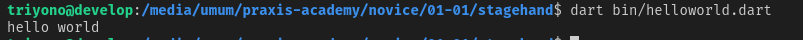
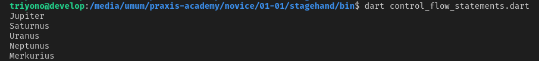
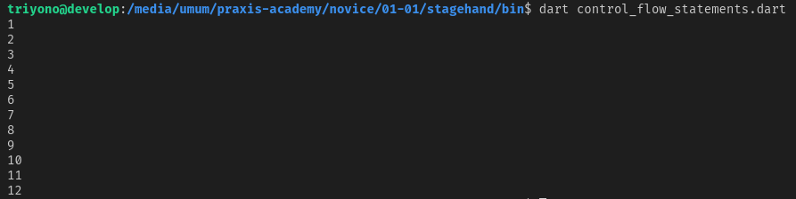
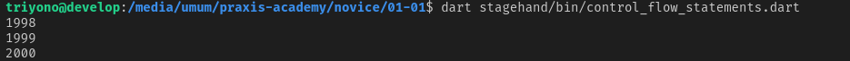
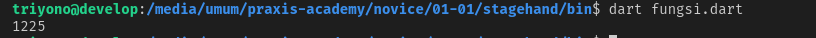

# Hari ke-1 | memulai dart
# Hello World

fungsi **main(){}** harus ada disetiap aplikasi yang dibuat
*helloworld.dart*

```dart
void main(){
print('Hello, World');
}
```
Hasil:



```dart
print();
``` 
digunakan untuk menampilkan teks pada console
## Variabel
pada dart dapat menggunakan **var** untuk semua tipe data dan secara otomastis tipe data kan menyesuaikan dengan **value** dari variabel tersebut
*control_flow_statements.dart*

```dart
var name = 'Voyager I';
var year = 1997;
var antennaDiameter = 3.7;
var flybyObject = ['Jupiter','Saturnus','Uranus','Neptunus', 'Merkurius'];
var image = {
'tags': ['merkurius'],
'url':'https://upload.wikimedia.org/wikipedia/commons/thumb/3/30/Mercury_in_color_-_Prockter07_centered.jpg/240px-Mercury_in_color_-_Prockter07_centered.jpg'
};
```
pada kode diatas variabel
**name** akan bertipe **String**, <br />
**year** akan bertipe **int**, <br />
**antennaDiameter** akan bertipe **double**, <br />
**flyObject** akan bertipe **array**, <br />
**image** akan bertipe **map** <br />

# Control flow statements

Variabel diambil dari pada latihan diatas

## Conditional Statements IF ELSE ##
Digunakan pada kasus dengan syarat tertentu atau terdapat beberapa kondisi yang memenuhi syarat
*control_flow_statements.dart*

```dart
if (year >= 2001){
print('abad 21');
}else if (year >= 1901){
print('abad 20');
}
```

## for in

**for in** loop dapat digunakan pada variabel yang berupa list atau array.
Jadi setiap object yang terdapat pada list tersebut akan dipanggil
*control_flow_statements.dart*
```dart
for (var namaobjek in flyObjects) {
print(namaobjek);
}
```

Hasil:



## for
**for** melakukan pengulangan dengan memberi inisiasi, batas pengulangan , dan operasi pengulanganya
*control_flow_statements.dart*

```dart
for (int month=1; month <= 12; month++){
print(month);
}
```

Hasil:




## while
**while** melakukan pengulangan saat kondisi terpenuhi atau **true**
*control_flow_statements.dart*

```dart
while (year < 2000){
year +=1;
print(year);
}
```

Hasil:




# Functions

fungsi digunakan supaya kode bisa reusable atau bisa dipakai ulang, jadi menghemat kodingan, 
penulisanya : **jenis_variabel** **nama_fungsi** (**jenis_variabel** **nilai**){**fungsi yang dijalankan**};
*fungsi.dart*
```dart
int perpangkatan(int n){
if (n==0 || n == 1) return n;
return n*n;
}

var result = perpangkatan(35);
print(result);
```
Hasil:



# Comments

pada dart komentar biasanya menggunakan **//** untuk memberi tanda atau penjelasan pada suatu kode
*comments.dart*

```dart
//komentar dalam satu baris

/// komentar dokumentasi untuk library, class dan member (auto nambah "///" saat enter)

/*
komentar untuk beberapa baris/paragraf
*/
```

# Imports

**import** digunakan untuk mengakses library

*import.dart*
```dart
//importing dari core library , library bawaan
import 'dart:math';

//import dari sumber lain (external package), atau diluar bawaan
import 'package:test/test.dart';

//import files 
import 'path/file/fila_lain.dart';
```


